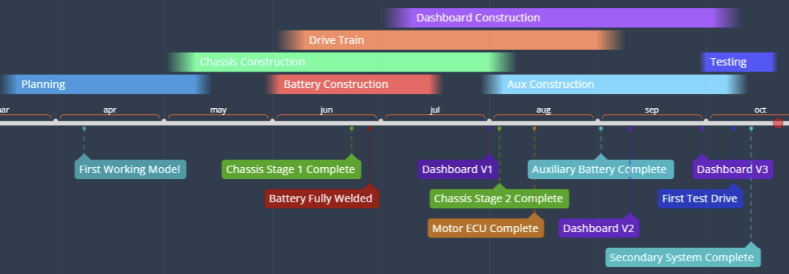
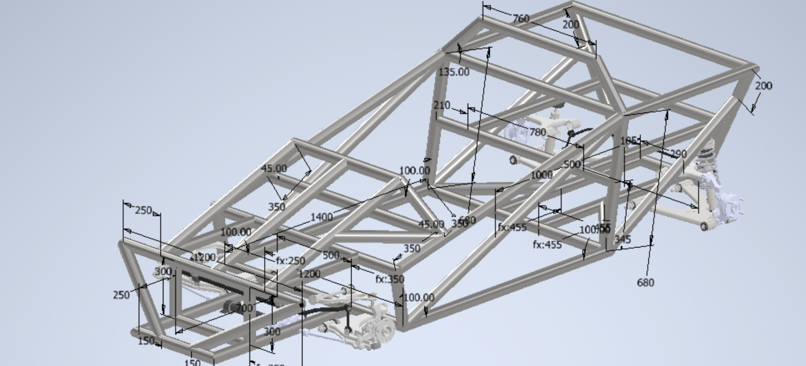
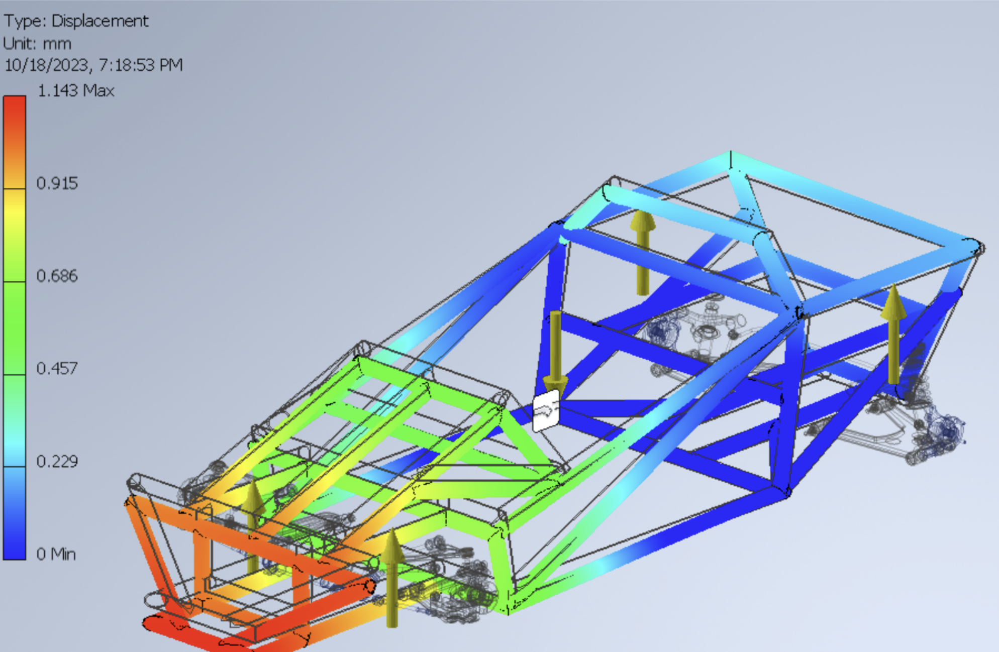
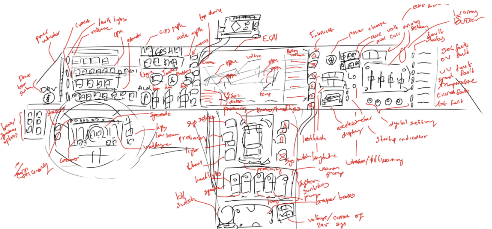
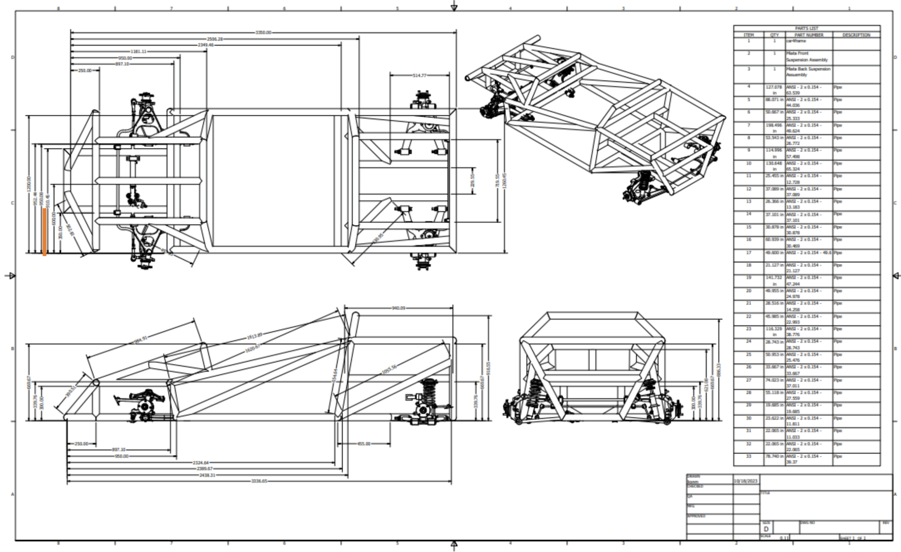
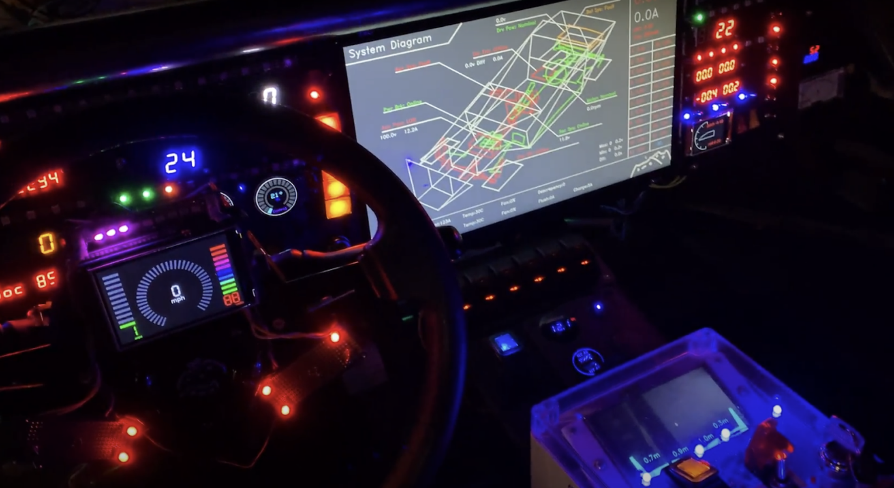

# Overview

This project’s objective is to design and prototype an affordable electric racecar to demonstrate the potential for EVs as an economically viable and environmentally sustainable transportation solution. 

**Objective**

The main objective is to create an electric vehicle within 6 months with a budget of $15,000 or less, capable of reliable road performance while minimizing the use of premade or off-the-shelf components.

**Scope**

This project involves the design, engineering, and fabrication of the following systems: Mechanical Chassis, Suspension Assembly, Traction battery, Electric power train, Auxiliary Battery, Auxiliary System, Secondary System, Proximity System, Thermal Regulation, User Interface, Energy Management, and Communication Systems.

As this project was done entirely by myself, I was responsible for research, design, engineering, construction, development, budgeting, and testing. 

**Timeline**

This project spans 5 months of construction, starting in late April 2023, and ending in early October

# Pictures

